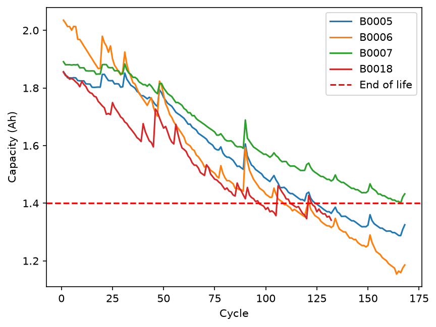
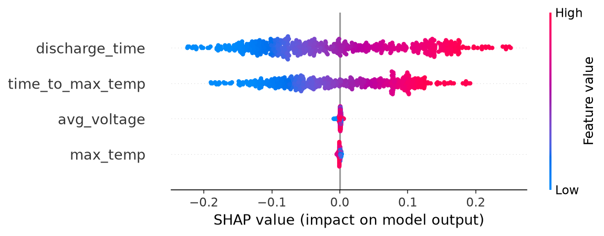

# First 20 Cycles: Catching Weak Battery Cells Before They Ship

Can a battery's first few cycles tell us whether it will wear out early?

In a battery factory, a cell that passes inspection but fails early ends up as a warranty return.
This project uses NASA's battery aging data to check whether the first 20 charge/discharge cycles
are enough to flag those cells before they ship.

**Short answer:** on the four main NASA batteries, yes. The early capacity trend flagged both
short-life batteries correctly, including one that started with the highest capacity of all.



## The problem

A battery is considered worn out when it drops to 1.4 Ah (70% of its rated 2 Ah).
The chart above shows four batteries losing capacity over time. They start close together but
wear out at very different speeds.

The interesting one is **B0006**. It starts with the most capacity (2.04 Ah) but is the second to wear out.
A check that only measures capacity once, when the battery is new, would pass it.
So the question isn't how much capacity a battery has on day one. It's how fast it's losing it.

## Data

[NASA Ames Li-ion Battery Aging Dataset](https://www.kaggle.com/datasets/patrickfleith/nasa-battery-dataset) (Kaggle CSV version).
I used batteries B0005, B0006, B0007 and B0018. They were cycled at room temperature with a constant 2 A discharge.

The data isn't included in this repo. Download it and place it in `data/cleaned_dataset/`.

## What I did

1. **Kept only discharge tests.** The dataset also has charge and impedance tests, but capacity is only measured during discharge.
2. **Plotted capacity fade** for each battery (chart above).
3. **Turned each discharge curve into a few numbers:** discharge time, average voltage, peak temperature, and when the peak happened. Every curve is cut at 2.7 V so the batteries are compared the same way.
4. **Trained a Random Forest** to predict capacity from those numbers. I tested it by training on three batteries and testing on the fourth, rotating through all four.
5. **Used SHAP** to see which features the model relied on.
6. **Built the QC check:** fit a line to the first 20 cycles, project when the battery will hit 1.4 Ah, and flag it HOLD if that's before cycle 120.

## Results

| What | Result |
|---|---|
| Capacity error, tested on unseen batteries | 0.026 Ah |
| Capacity error with a random split (misleading) | 0.0066 Ah |
| Error without the time-based features | 0.124 Ah |
| QC flag from the first 20 cycles | 4 / 4 correct |

| Battery | Projected end of life | Actual end of life | Flag |
|---|---|---|---|
| B0005 | cycle 217 | cycle 125 | PASS ✓ |
| B0006 | cycle 78 | cycle 109 | HOLD ✓ |
| B0007 | cycle 275 | never reached | PASS ✓ |
| B0018 | cycle 82 | cycle 97 | HOLD ✓ |

The projections aren't exact, but the check only needs to decide which side of 120 a battery falls on, and it got all four right.



## What went wrong along the way

**The random split fooled me at first.** Splitting cycles randomly gave an error of 0.0066 Ah, about 4 times better
than testing on unseen batteries. Neighbouring cycles of the same battery are almost identical, so the model had
effectively seen the test data already. In a factory every battery is new, so the battery-by-battery number is the honest one.

**Discharge time is a bit of a shortcut.** It was the model's top feature, but with a fixed 2 A current,
capacity is basically current × time. Without the time-based features, the error jumped from 0.026 to 0.124 Ah.

**My first QC check missed B0006.** I first used the model's *predicted* capacity for the early trend, and it
only caught B0018. Using 30 or 40 cycles didn't fix it. Using 30 made it worse, because of a recovery spike around cycle 30.

The cause: B0006 starts at 2.04 Ah, but the other batteries never go above 1.89 Ah. A Random Forest can't predict
higher than anything it has seen, so it flattened B0006's early values and the fade looked slow.
Switching to the **measured** capacity fixed it. A factory measures capacity during early cycling anyway,
so this is also more realistic.

## Limitations

- Only 4 batteries, so this is a promising first result, not proof.
- All four were tested at room temperature with the same discharge current.
- The batteries were discharged to different cutoff voltages (2.7, 2.5, 2.2 and 2.5 V), which may affect how their capacity compares.
- The upward spikes in the chart come from rest breaks during testing. They can throw off a simple trend line.

## Next steps

- Test the QC check on the other NASA batteries (different temperatures and loads)
- Try a curved fit instead of a straight line for the early trend
- Build a small Streamlit app: pick a battery, see its flag

## How to run

```bash
python -m venv venv
venv\Scripts\activate          # Mac/Linux: source venv/bin/activate
pip install -r requirements.txt
```

Download the dataset into `data/cleaned_dataset/`, then open `notebooks/notebook.ipynb` and run all cells.

## Project structure

```
├── notebooks/notebook.ipynb   main analysis
├── images/                    charts used in this README
├── data/                      dataset (not included, see above)
├── requirements.txt
└── README.md
```

## Tools

Python, pandas, NumPy, matplotlib, scikit-learn, SHAP
